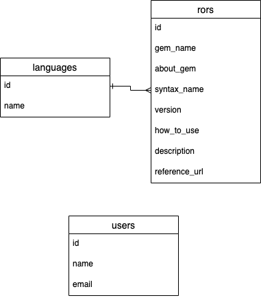

・アプリケーション名
search-statements

・アプリケーション概要
DBに保存したデータを保存できる

・URL

・テスト用アカウント
email:aaa@aaa.com
pass :aaaaaa

・利用方法
各言語のページ毎に言語で使われる記述が表示される。
検索機能もつけている

・目指した課題解決
このページで扱っている言語を勉強している初心者〜中級者向けのユーザーに、その言語の使い方を共有するため。
自分自身が忘れやすいのと、客先常駐の仕事の時でも見れるようにするため。
ノートだと記述や検索に時間がかかる上に紛失しやすいデメリットがあるから。

・洗い出した要件
複雑な画面遷移はしないこと
登録したデータは全てのユーザーに見れること
登録したデータは言語毎に表示できること
データの登録は管理者ユーザーのみ実行できること
全ての言語のデータにはバージョンの表記をすること

・実装した機能についてのGIFと説明
https://gyazo.com/fedde41c2919cd0dd2a0cb504c08763b
検索条件を指定して検索ボタンをクリックすると検索条件にヒットしたデータのみ出力される

・実装予定の機能
Ruby on Railsのデータ登録と表示、検索機能の実装
UiPathのデータ登録と表示、検索機能の実装
VBAのデータ登録と表示、検索機能の実装

・データベース設計

・ローカルでの動作方法
開発環境
Ruby on Rails
MySQL
Visual Studio Code